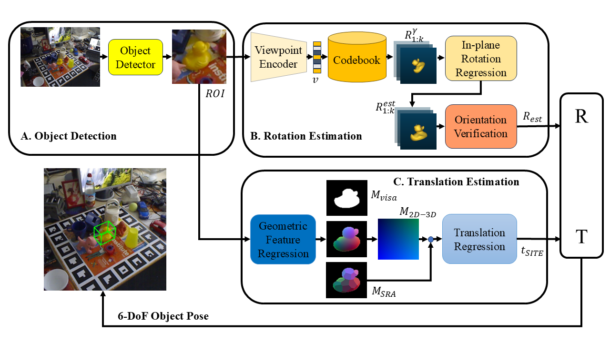

# Few-Shot 6D Object Pose Estimation via Decoupled Rotation and Translation with Viewpoint Encoding

<p align="center">
  
</p>

This repository contains the official implementation of the paper:

> **Few-Shot 6D Object Pose Estimation via Decoupled Rotation and Translation with Viewpoint Encoding**
> *Electronics, 2026*
> Lei Lu, Peng Cao, **Wei Pan**, et al.

The proposed framework explicitly **decouples rotation and translation estimation** for monocular RGB-based 6D object pose estimation under *few-shot supervision*.
Rotation is estimated via a **viewpoint-encoded retrieval framework trained purely on synthetic data**, while translation is regressed using **geometry-aware dense correspondences**, largely inspired by GDR-Net.

---

## Highlights

* 🔹 **Few-shot learning**: only **600 real images per object**
* 🔹 **Rotation–translation decoupling** reduces data dependency
* 🔹 **Viewpoint encoder + codebook retrieval** trained on ShapeNet
* 🔹 Evaluated on **LINEMOD, LM-O, YCB-Video**
* 🔹 Compatible with **BOP benchmark evaluation**

---

## Repository Structure

```text
fs6d/
├── assets/                  # Figures and visualizations
├── rotation/                # Viewpoint-encoded rotation estimation
│   ├── training/
│   ├── evaluation/
│   └── shapenet_render/
├── core/                    # Translation estimation (GDR-Net style)
│   └── modeling/
├── datasets/                # Dataset links / loaders
├── third_party/             # External dependencies (submodules)
│   ├── bop_toolkit/
│   ├── sixd_toolkit/
│   └── detectron2/
├── LM_pipeline.py
├── LMO_pipeline.py
└── README.md
```

---

## Requirements

### Environment

* Linux (recommended)
* Python ≥ 3.8
* CUDA ≥ 11.3
* PyTorch ≥ 1.10

We recommend using **Miniconda**:

```bash
conda create -n fs6d python=3.9 -y
conda activate fs6d
```

---

## Dependencies (via Git Submodules)

This project relies on the official evaluation and detection toolkits:

* **BOP Toolkit** (pose evaluation)
* **SIXD Toolkit** (legacy dataset utilities)
* **Detectron2** (object detection backbone)

Clone the repository **with submodules**:

```bash
git clone --recursive https://github.com/cp-0510/fs6d.git
cd fs6d
```

If already cloned:

```bash
git submodule update --init --recursive
```

### Install Detectron2 (from source)

```bash
cd third_party/detectron2
pip install -e .
```

> ⚠️ Detectron2 must be installed **from source** to ensure compatibility.

---

## Dataset Preparation

All datasets follow the **BOP format** and should be downloaded from:

👉 [https://bop.felk.cvut.cz/datasets/](https://bop.felk.cvut.cz/datasets/)

Supported datasets:

* **LINEMOD (LM)**
* **Occluded LINEMOD (LM-O)**
* **YCB-Video (YCB-V)**

Recommended directory layout:

```text
Dataspace/
├── lm/
├── lmo/
└── ycbv/
```

Set dataset root (example):

```bash
export BOP_DATASETS_ROOT=/path/to/Dataspace
```

---

## Rotation Estimation (Viewpoint Encoding)

### 1. ShapeNet Preprocessing (Synthetic Training Data)

Rotation estimation is trained **only on synthetic data** rendered from ShapeNet.

```bash
python rotation/training/preprocess_shapenet.py
```

**Requirements:**

* Blender ≥ 3.x installed and accessible via command line
* ShapeNetCore dataset

This step:

* Samples 4000 viewpoints per object
* Renders multi-view RGB images
* Constructs viewpoint codebooks

---

### 2. Rotation Network Training

```bash
python rotation/training/train_viewpoint_encoder.py
```

This trains:

* Viewpoint encoder
* In-plane rotation regressor
* Orientation verification module

---

### 3. Rotation Evaluation

Evaluate on LINEMOD / LM-O:

```bash
python LM_pipeline.py
python LMO_pipeline.py
```

---

## Translation Estimation (Geometry-Aware Regression)

Translation estimation follows the **GDR-Net design**, predicting dense 2D–3D correspondences.

### Training

```bash
./core/modeling/train_model.sh <config_path> <gpu_ids>
```

Example:

```bash
./core/modeling/train_model.sh configs/ycbv.yaml 0
```

### Evaluation

```bash
./core/modeling/test_model.sh <config_path> <gpu_ids> <checkpoint>
```

---

## Evaluation Metrics

* **ADD(-S)** with 10% object diameter threshold
* **AUC of ADD(-S)** (YCB-V)
* Optional strict **ADD(-S)@1cm** evaluation

All evaluation follows the **official BOP protocol**.

---

## Notes & Limitations

* Requires **accurate CAD models**
* Instance-level (not category-level generalization)
* Object detection quality affects overall performance
* Current implementation is **not optimized for edge deployment**

---

## Citation

If you find this work useful, please cite:

```bibtex
@article{lu2026few,
  title={Few-Shot 6D Object Pose Estimation via Decoupled Rotation and Translation with Viewpoint Encoding},
  author={Lu, Lei and Cao, Peng and Pan, Wei and Su, Zhilong and Zhang, Haojun and Zheng, Wangxing and Gao, Ge and Li, Peng},
  journal={Electronics},
  volume={15},
  number={3},
  pages={561},
  year={2026},
  publisher={MDPI}
}
```

---

## Acknowledgements

This work builds upon and reuses components from:

* **BOP Toolkit**
* **SIXD Toolkit**
* **Detectron2**
* **GDR-Net**

We sincerely thank the authors for making their code publicly available.

